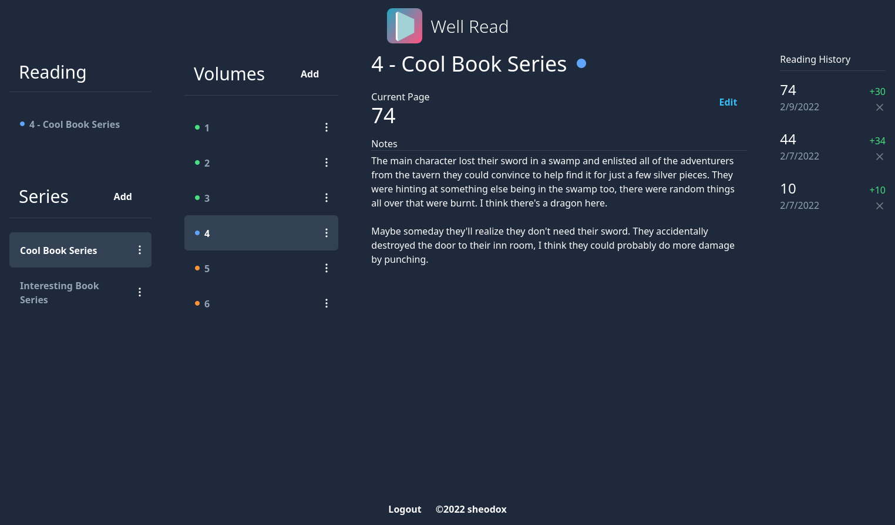

	
	<h1>Well Read</h1>

Well Read is a self-hosted website for tracking your reading of long book series.

I made this to track how many pages I read in a session and to better organize notes about where the story left off when I finish a volume. Once caught up on a long running series it might be 6+ months of waiting for a new volume to release, so I want to keep some notes to not be completely lost when I dive back into a new book.

## Setup

Requirements:

- `docker`
- `docker-compose`

Create a `.env` file using `.env.example` as a base, changing the database username and password as you please.

Run `./run.sh prod`

View the site at [http://localhost:4004](http://localhost:4004).

## Development

Requirements:

- `docker`
- `docker-compose`
- `node` 16+

Create a `.env` file as described above. Run the server with `./run.sh dev`. Any time you make changes to Go code run `docker-compose restart api` to run with your changes.

The frontend in development is built and hosted by [Vite](https://vitejs.dev/). Run `npm i` to install dependencies, then run `npm run dev` to start the Vite dev server.

View the site at [http://localhost:3000](http://localhost:3000).
